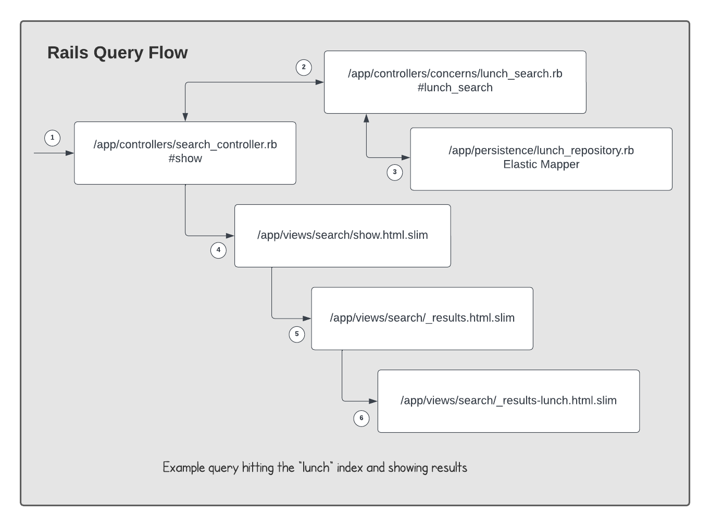
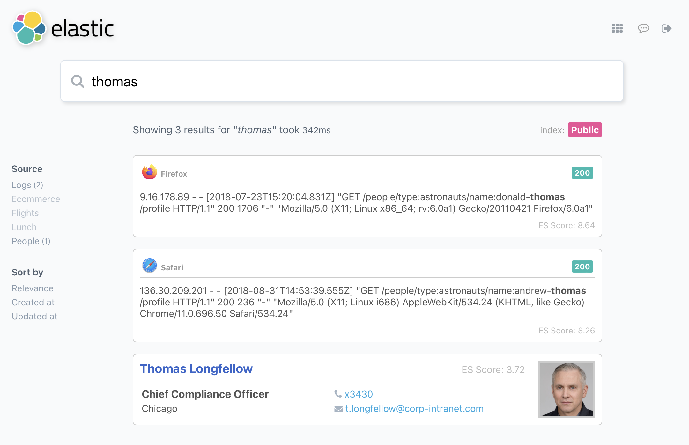
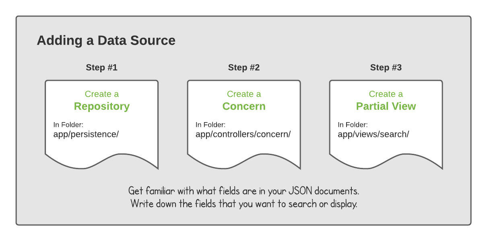

# Elastic Search Experience


The Elastic Search Experience (ESE) provides an intuitive search interface for your data.  Many people know how to use a search engine, and often turn to this simple interface to begin their quest for information.  The Elastic Search Experience satisfies this need, as a powerful tool to increase productivity by making large sets of data easily accessible.

The Elastic Search Experience is a customizable application that is configured to the needs of your users.  Templates are used to customize the search results  based on the data a user is searching.  Often times, data has to be presented in a particular way so that a user searching it can make sense of the results.  The Elastic Search Experience application is designed to be tailored towards these needs.

It's powered by Elasticsearch, which is a mature, scalable, open source, search engine.  Elasticsearch provides a flexible way to search over a wide variety of data.  The Elastic Search Experience application sits on top of it, and provides a friendly interface any user can understand with zero training.

## Alternatives

This repository is for Search Teams looking to run a universal search interface on top of large sets of data.  It requires familiarity with [Ruby on Rails](https://rubyonrails.org) to configure, customize, and run the application.  If your team isn't familiar with Ruby on Rails, I'd encourage you to try [Elastic App Search](https://www.elastic.co/app-search/).  It comes with a nice [React](https://react.dev) front-end called [Search UI](https://www.elastic.co/enterprise-search/search-ui) and an [Admin UI](https://www.elastic.co/app-search/).

## Elastic

This application depends on an Elastic cluster.  You can use a local instance or one running inside Elastic Cloud.

Run a local Elastic cluster in Docker:

- [Run Elasticsearch locally on Docker](https://www.elastic.co/guide/en/elasticsearch/reference/current/docker.html)
- [Run Kibana locally on Docker](https://www.elastic.co/guide/en/kibana/8.7/docker.html)

Run a cluster in Elastic Cloud:

- [Run Elasticsearch & Kibana in Elastic Cloud](https://cloud.elastic.co/pricing)

## Setup

Clone the repo to your local environment:

```bash
$ git clone github.com/gose/elastic-search-experience
```

Setup a new credential file:

```bash
$ rails credentials:edit
```

Add the following contents (setting values where necessary):

```yaml
elastic_local:
  user: "elastic"
  password: "xxx"
  scheme: "https"
  host: "localhost"
  port: "9200"

elastic_cloud:
  user: "elastic"
  password: "xxx"
  scheme: "https"
  host: "xxx"
  port: "443"

elastic_apm:
  secret_token: "xxx"
  server_url: "xxx"

user:
  password: 'demo'
```

The application comes with a built-in `demo` user to simulate authenticated searches.  When deploying this application to production, using OAuth is recommended.

## Rails Query Flow

The data you have in Elasticsearch can be queried via the `search_controller.rb`.  It has many `concerns` that contain the logic for the different indices you'll be querying in Elasticsearch.  For example, the `lunch_search.rb` concern will contain most of the Elastic domain logic.

Results are rendered by the document type returned from Elasticsearch, using a partial view in `app/views/search`.  Check out the partial views for Lunch results in `_results-lunch.html.slim`.  It provides a good reference for creating your own custom results based on your data.



1. The `search_controller` is the main entry point for a query
2. Based on the index being queried, a [Rails Concern](https://guides.rubyonrails.org/getting_started.html#using-concerns) is called
3. The concern will use a [persistence](https://www.elastic.co/guide/en/elasticsearch/client/ruby-api/current/persistence.html) layer [pattern](https://www.elastic.co/blog/activerecord-to-repository-changing-persistence-patterns-with-the-elasticsearch-rails-gem) to talk to Elasticsearch
4. After results are retrived and mapped to an object, they're handed off to the `show` view
5. The bulk of the `show` logic is captured inside the partial template `_results.html.slim`
6. Based on the index being queried, different views for documents are rendered (seen screenshot below)

Mixed Result Types:



If you're not familiar with Elasticsearch terminology (e.g., "documents", "indexes", "fields", etc.), you can read more in [Data in: documents and indices](https://www.elastic.co/guide/en/elasticsearch/reference/current/documents-indices.html).  Another great overview is the [What is Elasticsearch?](https://www.elastic.co/guide/en/elasticsearch/reference/current/elasticsearch-intro.html) page.

## Adding a Data Source

To add a new data source to your Elastic Search Page, follow these general steps.



Some logs in Elastic can contain many fields.  As you think about adding a new data source to your search page, sometimes it helps to write down the specific fields from a document that you want to search or render.  This can make it easier to onboard the data source without being overwhelmed by the number of fields some data sources contain.

View all the Data Sources available:

* [Logs](/data/logs/README.md)
* [Flights](/data/flights/README.md)
* [Ecommerce](/data/ecommerce/README.md)
* [People](/data/people/README.md)
* [Lunch](/data/lunch/README.md)
* [Wikipedia](/data/wikipedia/README.md)
