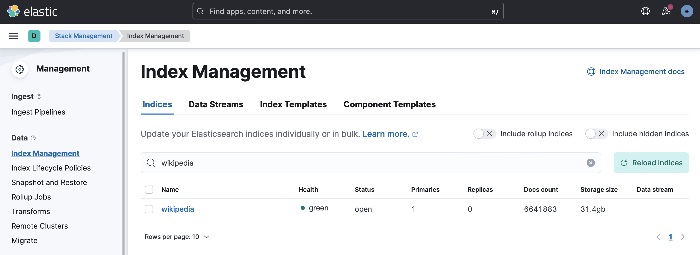

# Wikipedia

The Wikipedia dataset consists of a 34 GB file containing gzipped JSON.

> enwiki-20230410-cirrussearch-content.json.gz

Uncompressed, the file size is 142 GB.

There's a script called `main.rb` which will import it into Elasticsearch.

```
$ ./main.rb
usage: ./main.rb [options]
    -c, --create  Create the index
    -d, --delete  Delete the index
    -i, --import  Import the index
    -s, --status  Get cluster status
    -p, --prod    Use production cluster (default: local cluster)
    -f, --full    Full load (default: 5 docs)
```

It takes approximately 2 hours to ingest the 6.6 M articles from the English Wikipedia content set.

Once indexed, it will take up ~32 GB of disk in Elasticsearch.



References:

- https://www.elastic.co/blog/loading-wikipedia
- https://dumps.wikimedia.org/other/cirrussearch/current/
- https://en.wikipedia.org/wiki/Wikipedia:Size_of_Wikipedia
